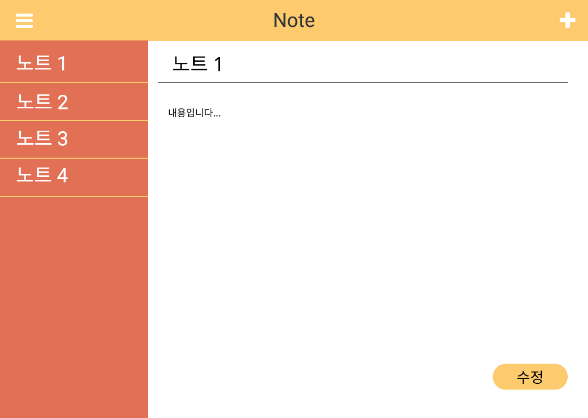
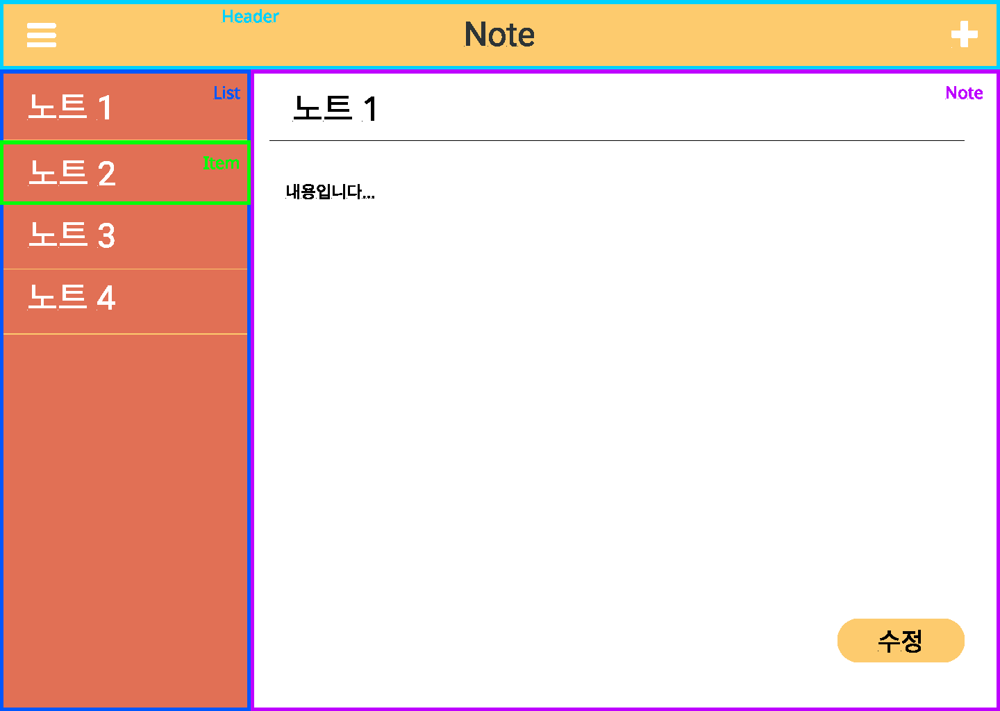

> **이 강좌는 지식을 얻는 것보다 무작정 따라 하며 코딩에 익숙해지는 것이 목적입니다.** 더 쉬운 설명을 위해 잘못된 설명이 있을 수 있습니다. 무작정 따라 하며 익숙해진 뒤 잘못된 부분들을 찾아보세요.

## 목차

1. [화면 구성하기](##화면-구성하기)
2. [컴포넌트 구성하기](##컴포넌트-구성하기)
3. [프로젝트 시작하기](##프로젝트-시작하기)

## 화면 구성하기

지금까지 배운 리액트를 이용해서 Note 앱을 직접 만들어 보도록 하겠습니다. 우선 노트 앱을 만들기 위해 화면을 직접 그려보고 컴포넌트를 구성해보아야 합니다.



왼쪽으로 노트들의 목록이 보이고 오른쪽에서 노트의 내용을 보고 수정하거나 새로운 노트를 작성할 수 있도록 구성하였습니다. 수정버튼 혹은 추가 버튼을 누를 시 오른쪽 화면의 제목부분과 내용부분이 입력창으로 바뀌도록 하겠습니다.

## 컴포넌트 구성하기

이제 직접 그린 그림을 컴포넌트 단위로 묶어서 표시해줍니다.



상단에 Header와 왼쪽 목록에 List와 Item 그리고 오른쪽에 Note로 컴포넌트를 나누어 주었습니다.

## 프로젝트 시작하기

이제 로컬 환경에서 직접 프로젝트를 시작해보도록 하겠습니다. 원하는 디렉토리에서 터미널을 켜고 리액트 설정을 해주도록 합니다.

```bash
npx create-react-app note
```

이제 해당 디렉토리에 create-react-app을 통해 생성한 폴더가 있을 것입니다. 해당 폴더를 visual studio code 에디터에 가져와줍니다.

```
note/
├── node_modules
├── public
├── src
├── .gitignore
├── package.json
├── README.md
└── yarn.lock
```

`src/App.js`에서 작업을 시작하면 됩니다.
