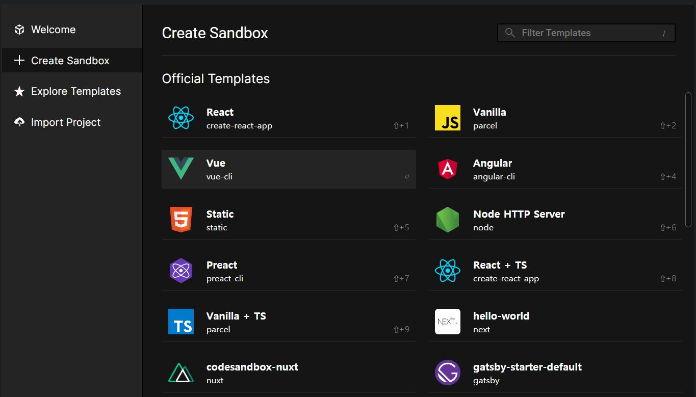
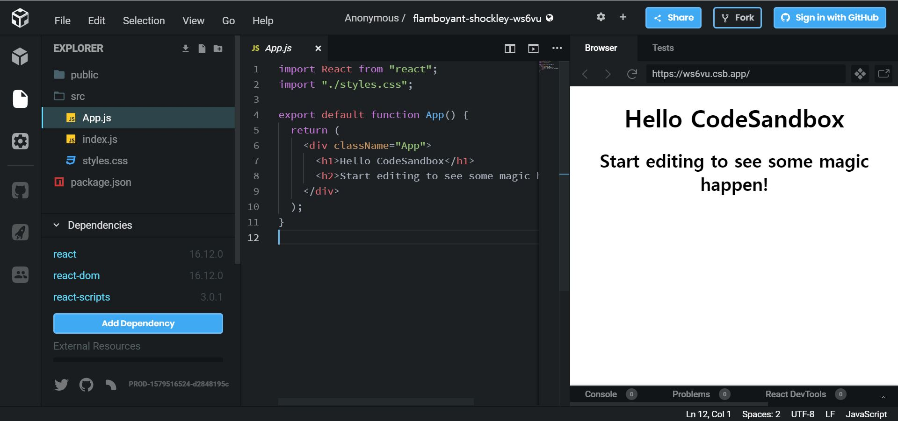

> **이 강좌는 지식을 얻는 것보다 무작정 따라 하며 코딩에 익숙해지는 것이 목적입니다.** 더 쉬운 설명을 위해 잘못된 설명이 있을 수 있습니다. 무작정 따라 하며 익숙해진 뒤 잘못된 부분들을 찾아보세요.

## 목차

1. [리액트 시작하기](#리액트-시작하기)
2. [리액트의 구조](#리액트의-구조)
3. [JSX](#JSX)

## 리액트 시작하기

리액트를 시작하기 위해서는 여러가지 환경설정이 뒷받침 되어야합니다. 하지만 이러한 환경설정을 신경쓰지않고 코딩만 할 수 있도록 도와주는 클라우드 서비스(코드샌드박스)를 이용하도록 하겠습니다.

1. [codesandbox.io](https://codesandbox.io/) 에 접속합니다.
   

2. **Create a Sandbox** 를 선택합니다.
   

3. **React** 를 선택합니다.
   
   `왼쪽부터 디렉토리 구조를 나타내는 곳, 코드를 작성할 수 있는 곳, 실행됐을 때 화면 으로 구분됩니다.`

디렉토리 구조는 신경쓰지 않고 App.js에 모든 코드를 작성할 예정이기 때문에 디렉토리 구조 창을 꺼줍니다.

## 리액트의 구조

리액트에서 화면을 표시하기 위해서 함수를 작성해야합니다. 함수의 이름 첫글자가 대문자로 시작하며, Element들을 포함할 수 있는 **한 개**의 Element를 반환하면 리액트를 이용해 화면을 표시할 수 있습니다.

```jsx
function App() {
    return <h1>Hello World!</h1>;
}
```

## JSX

리액트에서 Element를 작성하기 위해 html과 비슷한 작성법을 이용하는데 이는 사실 html과는 다르다. react에서 직접 만든 **JSX**라는 문법이다. 이를 사용하기 위해서 파일 상단에 `react`를 불러와준다.

```javascript
import React from 'react';
```

이제 JSX를 사용할 수 있는데 html과 동일하게 작성하나 몇 가지 규칙이 존재한다.

1. 반드시 열림태그가 있으면 닫힘태그도 있다. (열림과 닫힘을 한번에 작성할 수 있다.)
2. html이 아닌 javascript이기 때문에 대부분의 속성이름은 camelCase로 작성한다.
3. Element 내부 또는 속성값에 javascript를 사용하기 위해서 `{}`를 작성하고 내부에 javascript를 작성해준다.
4. 여러 Element를 사용하려면 `()`로 감싸주면된다. 하지만 반드시 하나의 Element를 반환해야한다.
