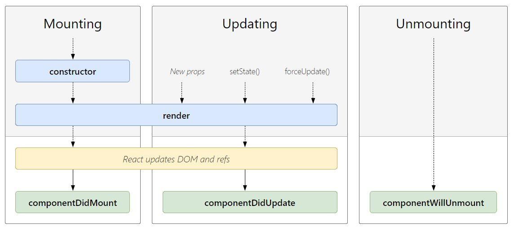

> **이 강좌는 지식을 얻는 것보다 무작정 따라 하며 코딩에 익숙해지는 것이 목적입니다.** 더 쉬운 설명을 위해 잘못된 설명이 있을 수 있습니다. 무작정 따라 하며 익숙해진 뒤 잘못된 부분들을 찾아보세요.

## 목차

1. [생명주기](##생명주기)
2. [mount](##mount)
3. [render](##render)
4. [update](##update)

## 생명주기

모든 소프트웨어는 생명주기를 갖습니다. 리액트 역시 마찬가지로 생명주기를 갖는데 리액트에서 모든 생명주기는 화면을 그리는 것과 연관이 있습니다. 화면에 값을 나타내는 일을 하는 전 후에 여러가지 작업을 처리할 수 있도록 생명주기에 맞게 코드를 작성해 줄 수 있습니다. 리액트의 생명주기를 미리 살펴보겠습니다.
[리액트 생명주기](http://projects.wojtekmaj.pl/react-lifecycle-methods-diagram/)


## mount

웹에서 화면을 그리기 위해서는 html의 dom element와 css를 해석해서 화면에 나타내줍니다. 하지만 리액트는 html을 작성하는 것이 아닌 javascript로 dom element를 생성하기 때문에 html의 dom element가 먼저 생성된 이후에 리액트가 동작합니다. dom element를 생성하는 과정을 mounting이라고 하며 마운트가 이루어진 이후에 화면이 나타나고 마운트가 끝난 다음에 동작할 수 있는 didMount가 실행됩니다. 이 때 원하는 작업을 수행하기 위해서는 리액트의 `effect`를 이용해야합니다.

```javascript
import React, { useEffect } from 'react';
```

리액트 함수 내부에서 useEffect를 사용해서 생명주기를 나타낼 수 있습니다. useEffect에는 두 가지 파라미터가 사용되는데 첫번째는 수행할 함수, 두번째로 변경을 감지할 것들이 들어갑니다.

```javascript
function App() {
    useEffect(() => {
        console.log('did mount');
    }, []);
}
```

위 처럼 작성할 경우 어떠한 생명주기에서 해당 함수를 수행하겠다는 뜻입니다. 이때 두번째 인자로 들어가는 **변경을 감지할 것**이 배열로 들어가는 데 빈 배열일 경우 아무런 변경도 감지하지 않겠다는 의미를 지니며 최초 mount된 이후 딱 한번만 실행됩니다.

mount가 화면이 최초 그려지는 순간이면 화면을 벗어나거나 브라우저를 종료할 경우 unmount가 실행됩니다. unmount가 실행되기 전에 어떤 작업을 수행하기 위해선 생명주기에 맞게 작성해주어야 하는데 이는 useEffect에 들어가는 함수의 반환값으로 작성해 주면 됩니다. useEffect의 첫번째 인자인 함수가 반환하는 함수가 unmount 전에 수행될 함수 입니다.

```javascript
function App() {
    useEffect(() => {
        console.log('did mount');
        return () => {
            console.log('will unmount');
        };
    }, []);
}
```

## render

리액트에서 화면을 그리기 위한 함수는 render함수 입니다. 어떤 것이 그려질 지에 대한 정보는 리액트 함수의 반환 값이 결정합니다.

```jsx
function App() {
    // render가 그릴 것
    return (
        <div>
            <h1>Hello React</h1>
        </div>
    );
}
```

이 render 함수를 호출하기 위해서는 화면에 그려진 값이 변경되어서 새로 그릴 것이 생겨야 합니다. 그래서 그전에 state로 작성한 값에 setState함수를 호출 해 새로운 값으로 변경되면 render가 실행됩니다.

## update

새롭게 값이 변경되어서 다시 render가 됐을 때 역시 생명주기에 의해 어떤 작업을 수행하도록 할 수 있습니다. 이를 did update라고 부르며 역시 useEffect를 사용합니다.

```javascript
function App() {
    const [count, setCount] = useState(0);
    useEffect(() => {
        console.log('count did update');
    }, [count]);
}
```

useEffect에 두번째 인자로 변경을 감지할 것을 추가해주면 되는데 배열에 state들을 넣어줄 수 있습니다. 위처럼 작성할 경우 count값이 변경되는 것을 감지하면 변경된 이후에 호출 됩니다.
